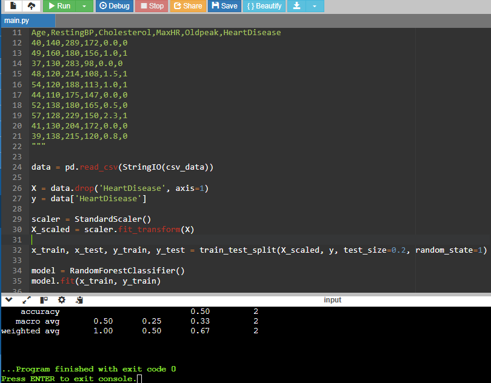

# Heart Disease Prediction

This machine learning project predicts whether a person has heart disease based on health-related features such as age, cholesterol, chest pain type, and more.

## Dataset
- 1,025 samples
- 14 features (categorical and numerical)
- Target: 0 = no heart disease, 1 = heart disease

## Models Used
- Logistic Regression
- Support Vector Machine (SVM)
- Random Forest (best performing model with 88% accuracy)

## Evaluation Metrics
- Accuracy
- Precision
- Recall
- F1-Score
- Confusion Matrix
- ROC Curve

## Tools and Libraries
- Python
- scikit-learn
- pandas, numpy
- matplotlib, seaborn

## Project File
- `Heart Disease ML Report.pdf`: Contains the full report with data analysis, model comparison, and results

## Sample Output
Below is a screenshot showing part of the code and model output used in this project:

## How to Run this Project
You can run the notebook on **Google Colab** or your local system.

1. Go to the notebook file: [`heart_disease_prediction_full_dataset.ipynb`](https://github.com/raniyashareef/heart-disease-prediction/blob/main/heart_disease_prediction_full_dataset.ipynb)
2. Click the **"Open in Colab"** button (or open it manually in Colab)
3. Run all the cells one by one (Shift + Enter)

> 📝 Note: The PDF report (`Heart Disease ML Report.pdf`) was submitted as part of a short course (AI with Python – Techmaghi).  
> The Jupyter Notebook (`heart_disease_prediction_full_dataset.ipynb`) is an improved version using the full dataset and Google Colab.
